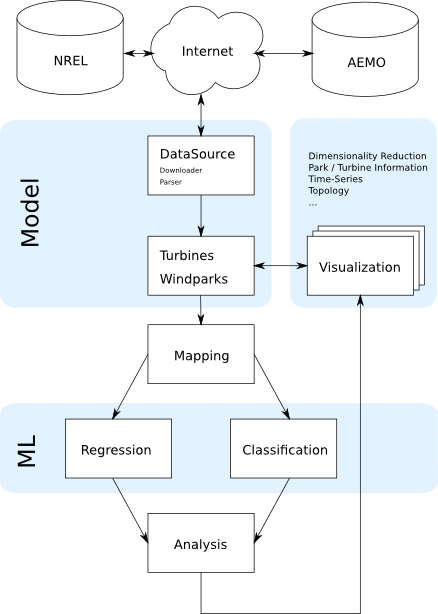

.. _gettingstarted:

Getting Started
===============

The first part of this page provides an installation guide, see :ref:`installation`.
Second, an overview of the architecture is presented and the core
features and components are discussed, see :ref:`architecture`. At last,
it is exemplary illustrated how windML is used, see :ref:`runningexample`.  

.. _installation:

Installation
------------

The windML framework is in an early stage of development. Before the installation of windML you have to make sure all needed dependencies are installed. The current dependencies are: Python >= 2.7, Sphinx, sklearn, numpy, scipy, texlive, texlive extra packages, matplotlib, basemap, PIL, libjpeg-dev libfreetype6-dev. To install windML you have to check out a working copy of our stable branch in our development repository. ::
    
    git clone git@vegas.informatik.uni-oldenburg.de:windml/windml.git windml

After cloning the stable branch the new folder windml is located in your current directory. Make sure windml is in your Python PATH by executing. ::
    
    export PYTHONPATH=PYTHONPATH:<windml-directory>

.. _architecture:

Architecture
------------
Below a schematic image of architecture is illustrated. The following description of the architecture is done from top to bottom. On the top you can see available data sources of wind data time series on the internet. DataSource classes are implemented in windML which download the data from data mirrors, parse the data into an windML-specific format and cache the data locally. The windML-specific format is defined by the Windpark and Windmill classes. See :ref:`windpark` and :ref:`windmill` documentation for the windML-specific model. The Windparks and Windmills are selected by ID and a certain radius. See :ref:`datasets` page for the documentation of the datasets and methods to fetch time series.

   windML schematic architecture

Given windpark and windmill objects you can visualize the data via different visualization components such a dimension reduction, park / mill information, information on the time series, topology etc., see :ref:`examples`. The main motivation of windML is forecasting time series with machine learning. In this field of research, regression and classifcation of time series is possible. For both methodologies a mapping of a time series to labels is essential. Different mapping approaches have been tested in the past, see :ref:`mapping` for explanation of the various mapping methods. In the current release only regression techniques have been applied to forecasting. The implemented methods are Support Vector Regression, KNN Regression and Linear Regression. 

.. _runningexample:

Running an Example
------------------

Running some examples of windML is probably the best thing to start. In the :ref:`examples` gallery all example scripts which are located in the /examples folder of your windML installation are plotted. To run an example you only have to run the Python script. Please make sure that you've installed windML in the right manner. If you're not sure if windML is correctly installed, see the :ref:`installation` page. 

.. [1] Travis E. Oliphant (2007).  Python for Scientific Computing. Computing in Science & Engineering 9, IEEE Soc.
.. [2] Hunter, J.  D. (2007). Matplotlib: A 2D graphics environment. Computing In Science & Engineering 9, IEEE Soc., pp. 90-95

