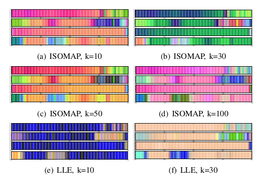

.. _techniques:

Techniques
==========

This page presents the techniques applied to the wind data sets. The focus is on forecasting of wind speed, wind power and ramps. The forecasting is based on machine learning methodologies on discrete time series. In the following the :ref:`windenergyprediction` is discussed as a regression task. In the next section the detection of ramps via classification is explained, see :ref:`detectionoframps`. Finally, ML-derived visualization of time series is illustrated, see :ref:`visualizationoftimeseries`.  

.. _windenergyprediction:

Wind Energy Prediction
----------------------

Motivation
++++++++++
For the integration of wind power into the grid, a precise forecast of energy
has an important part to play. Only with these informations a truly sustainable
supply with low support of conventional energy rersources can be achieved.

.. _generaltimeseriesmodel:

General Times Series Model
++++++++++++++++++++++++++

Our model makes predictions exclusively based on past wind power measurements.
For this task, we formulate the prediction as regression problem. Let us first
assume we want to predict the power production of a single turbine with its
time series: The wind power measurement :math:`\mathbf{x} = p(t)` (pattern) is
mapped to the power production at target time :math:`y = p(t+t_h)` (label).
For our regression model we assume to have :math:`N` of such pattern label
pairs :math:`(\mathbf{x}^i,y^i)` that are basis of our training set
:math:`T=\{(\mathbf{x}^1,y^1),\ldots,(\mathbf{x}^n,y^n)\}` and allow via a
regression to predict the label for unknown patterns.

One can assume, that this model generates better prediction, if more
information of the times series will be used. For this reason, we extend the
patterns by appending past measurements :math:`p(t-1),\ldots, p(t-\mu)` with
:math:`\mu \in \mathbb{N^+}`. Furthermore, we test, if taking into account
differences of measurements :math:`\Delta p(t)=p(t)-p(t-1), \ldots,` :math:`\Delta
p\big(t-(\mu-1)\big)-p(t-\mu)` leads to better results. Therefore, we consider
on the one hand only the absolute values of the measurements as features and
get patterns with dimension :math:`d_{st}=(\mu+1)`, see :ref:`powermapping`. On
the other hand we use both, i.e. the absolute values and their differences that
results in patterns with a dimension of :math:`d_{st}=(2\mu+1)`, see
:ref:`powerdiffmapping`.

Different Regressors
++++++++++++++++++++

Different regressors can be used for forecasting. Currently, the `Linear
Regression <http://en.wikipedia.org/wiki/Linear_regression>`_, the `Support
Vector Regression
<http://en.wikipedia.org/wiki/Support_vector_machine#Regression>`_ (SVR) and the
`K-nearest Neighbor Regression
<http://en.wikipedia.org/wiki/K-nearest_neighbors_algorithm#For_regression>`_
(KNN Regression) are presented in examples. In Example
:ref:`example_linear_regression` a linear regressor is used. The SVR is used in
example :ref:`example_svr_regression`. In Example :ref:`example_knn_regression`
a KNN regressor is employed. 

.. _detectionoframps:

Classsification of Wind Energy Ramp Events
------------------------------------------

Motivation and Overview
++++++++++++++++++++++
A critical issue in maintaining grid stability are sudden and large changes (up and down) of wind power, which are called ramp events. In this section, we introduce the wind power ramp event prediction module. After the definition of ramp events, we define the ramp event prediction problem as classification problem and introduce the ramp separation and the ramp detection application case.

Ramp Event Definition
+++++++++++++++++++++

In literature, ramps are not clearly defined {kamath,focken} and may vary in location and sizes of wind farms and turbines. We define a ramp events as follows. Let :math:`\mathbf{x}(t)` be the wind time series of a wind park, and let :math:`y(t)` be the time series of the target turbine, for which we determine the forecast. A ramp event is defined as a wind energy change from time step :math:`t` to time step :math:`t+\lambda` by :math:`\theta \in (0, y_{\max}]`, i.e., for an ramp-up event, it holds :math:`y(t+\lambda) - y(t)>\theta`, for a ramp-down event it holds :math:`y(t+\lambda) - y(t)<-\theta`.

.. _visualizationoftimeseries:

Visualizing of Times Series: Dimensionality Reduction Moduls
------------------------------------------------------------

Motivation and Overview
+++++++++++++++++++++++

In this section one can find the explanation how to visualize high-dimensional wind time series. Monitoring of high-dimensional time-series data is a dimensionality reduction (DR) task. DR methods map high-dimensional patterns :math:`\mathbf{X} = [\mathbf{x}_i \in \mathbb{R}^d]_{i=1}^N` to low-dimensional representations :math:`[\hat{\mathbf{x}}_i \in \mathbb{R}^q]_{i=1}^N` in a latent space :math:`\mathbb{R}^q` with :math:`q<d`. The mapping should maintain important properties of the original high-dimensional data, e.g., topological characteristics like distance and neighborhoods. Such properties could be gradual changes in wind time series such as changing weather conditions or seasonal changes. Visualization of alert states belongs to the main applications of monitoring energy time series.

   Different Dimensionality Reduction Methods on a Time Series

In [1]_, we employed self-organizing maps (SOMs) for sequence visualization of high-dimensional wind time series. Similar to vector quantization, we employed the SOM to place codebook vectors in the time series data space. Each neuron was assigned to a color accruing to the position in the lattice structure of the SOM. The capabilities to visualize gradual changes of SOM-based monitoring is strongly restricted to the topology of the map, e.g., the number of neurons and the structure of the network. 

The monitoring module of WindML allows embeddings in continuous latent spaces. It allows the application of the scikit-learn DR methods like PCA, isometric mapping (ISOMAP) [2]_, and locally linear embedding (LLE) [3]_. 

Latent Embeddings
+++++++++++++++++

Monitoring
++++++++++

.. [1] Kramer, O, Gieseke, F., and Satzger, B. (2013). Wind energy prediction and monitoring with neural computation. Neurocomputing, 109:84-9.
.. [2] Tenenbaum, J.B., Silva, V.D., and Langford, J.C. (2000). A gloabal geometric framework for nonlinear dimensionality reduction. Science, 290:2319-2323.
.. [3] Roweis, T.S. and Saul, L.K. (2000). Nonlinear dimensionality reduction by locally linear embedding. Science, 290:2323-2326.
