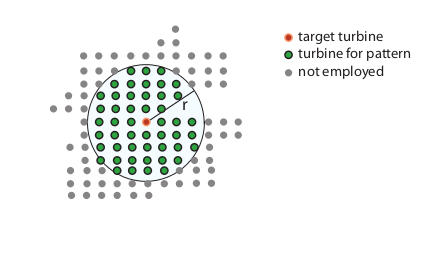
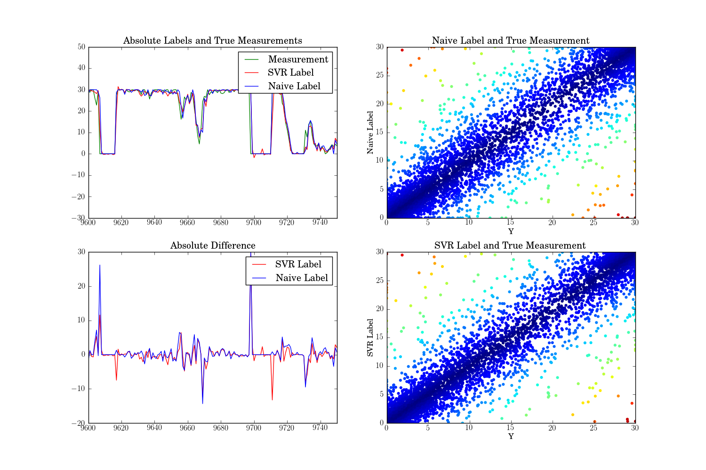

.. _techniques:

Techniques
==========

This page highlights selected techniques applied to the wind data sets. The
focus is on forecasting of wind speed and wind power. The forecasting is based
on machine learning methodologies on discrete time series. In the following,
the :ref:`windenergyprediction` is introduced as a regression task.  Finally, a
dimensionality reduction based visualization of the wind time series is
presented, see :ref:`visualizationoftimeseries`.  

.. _windenergyprediction:

Wind Energy Prediction
----------------------

Motivation
++++++++++

For an integration of sustainable wind energy into the smart grid, a precise
forecast of wind energy production has an important part to play. 

.. _generaltimeseriesmodel:

General Times Series Model
++++++++++++++++++++++++++

The model predicts wind power exclusively based on past wind power
measurements.  For this task, one can formulate the prediction as regression
problem examplary for a single wind mill. 

The wind power measurement :math:`\mathbf{x} = p(t)` (pattern) is mapped to the
power production at target time :math:`y = p(t+\lambda)` (label).  For the
regression model, we assume to have :math:`N` of such pattern label pairs
:math:`(\mathbf{x}_i,y_i)` that are basis of our training set
:math:`T=\{(\mathbf{x}_1,y_1),\ldots,(\mathbf{x}_N,y_N)\}` and allow via a
regression to predict the label for unknown patterns. It can be expected that
the model yields better predictions, if more information of the times series is
employed. For this reason, we extend the patterns with :math:`\mu \in
\mathbb{N^+}` past measurements to :math:`\mathbf{x} = p(t), p(t - 1),\ldots,
p(t - \mu)`. The implementation of this approach is called :ref:`powermapping`.

.. figure:: _static/genmapping.png
   :alt: General Times Series Model
   :align: center

Furthermore, we test, if taking into account differences of measurements
:math:`p(t)-p(t-1), \ldots, p\big(t-(\mu-1)\big) - p(t-\mu)` further improves
the results. The absolute values and their differences result in patterns with a
dimension of :math:`d_{st}=(2\mu+1)`, see :ref:`powerdiffmapping`.

Most prediction tasks require the construction of a pattern which consists of
wind power time series of wind mills in the neighborhood of the target wind
mill. See the corresponding figure above. A wind park is defined by a target
wind mill and a certain radius :math:`r`. Wind power values can be aggregated
to a single value or can seperately be used in the pattern vector.

Wind Prediction as a Regression Problem
+++++++++++++++++++++++++++++++++++++++

In the following, we employ support vector regression for prediction of a time
series of wind power for a target wind mill in Tehachapi, see
:ref:`example_svr_regression`. The prediction model is based on the wind power
time series of the target mill and the time series of its neighbors defined by
a radius of 3 kilometers.For the mapping of pattern-label combinations the
:ref:`powermapping` is used. The power mapping is based on the
:ref:`generaltimeseriesmodel`. The feature window and the forecast horizon both
consist of 3 elements of every time series. Because of performance issues, in
this example only every fifth element is used for training and testing.  The
top left plot compares the SVR prediction and the naive model to the actual
wind power measurements.  The bottom left plot shows the differences of the
corresponding models.  The plots on the right hand side show the actual and
predicted measurement pairs show the actual and predicted measurement pairs.
The absolute prediction error is the deviation to the main diagonal.

Currently, the `Linear Regression
<http://en.wikipedia.org/wiki/Linear_regression>`_, the `Support Vector
Regression <http://en.wikipedia.org/wiki/Support_vector_machine#Regression>`_
(SVR) and the `K-nearest Neighbor Regression
<http://en.wikipedia.org/wiki/K-nearest_neighbors_algorithm#For_regression>`_
(KNN Regression) are presented in examples. In Example
:ref:`example_linear_regression` a linear regressor is used. The SVR is used in
example :ref:`example_svr_regression`. In Example :ref:`example_knn_regression`
a KNN regressor is employed. 

.. _visualizationoftimeseries:

Visualizing of Times Series: Dimensionality Reduction 
-----------------------------------------------------

Motivation and Overview
+++++++++++++++++++++++

In this section, one can find the explanation how to visualize high-dimensional
wind time series. Monitoring of high-dimensional time-series data is a
dimensionality reduction (DR) task. DR methods map high-dimensional patterns
:math:`\mathbf{X} = [\mathbf{x}_i \in \mathbb{R}^d]_{i=1}^N` to low-dimensional
representations :math:`[\hat{\mathbf{x}}_i \in \mathbb{R}^q]_{i=1}^N` in a
latent space :math:`\mathbb{R}^q` with :math:`q < d`. The mapping should maintain
important properties of the original high-dimensional data, e.g., topological
characteristics like distance and neighborhoods. Such properties could be
gradual changes in wind time series such as changing weather conditions or
seasonal changes. Visualization of alert states belongs to the main
applications of monitoring energy time series.

The monitoring example of WindML allows embedding into continuous latent spaces
with scikit-learn DR methods like isometric mapping (ISOMAP) [2]_ and locally
linear embedding (LLE) [3]_. We demonstrate the applications in the following.
First, we show the results of embedding the high-dimensional patterns into
2-dimensional latent spaces. Then, we use the mapping into 3-dimensional latent
spaces to monitor high-dimensional wind power time-series on the time axis.

Latent Embeddings
+++++++++++++++++

The high-dimensional patterns :math:`\mathbf{X}` are mapped to a 2-dimensional
continuous latent space :math:`\mathbb{R}^2`. To illustrate, how the results of
this first step look like, we visualize the learning results for
two-dimensional latent spaces. The figure shows the learning results of ISOMAP
with (a) neighborhood size :math:`k = 10` and (b) neighborhood size :math:`k =
30`. The data set employs :math:`d = 66` wind turbines (grid points) in a
radius of :math:`r = 10` km around a turbine in Tehachapi, California. 

.. figure:: _static/latent_embeddings.png
   :alt: Comparision of Wind Time Series Embeddings of ISOMAP for different parameters
   :align: center

   Comparision of Wind Time Series Embeddings 

Both manifold learning results show that ISOMAP is able to adapt to gradually
changing wind situations. The embeddings employ colors according to the average
wind power in the corresponding sequence, see :ref:`example_wind_embeddings`. 

Monitoring
++++++++++

The monitoring example offers the possibility to visualize the DR result
along the time axis. For this sake, the latent positions of the trained
manifold are used for colorization of a horizontal bar over time of a test
time series. In the test time series, pattern :math:`\mathbf{x}_t` of time step
:math:`t` is assigned to the color that depends on the latent position
:math:`\hat{\mathbf{x}}^*` of its closest embedded pattern :math:`\mathbf{x}^*
= \arg \min_{\mathbf{x}' \in \mathbf{X}} \|  \mathbf{x}_t - \mathbf{x}'\|^2` in
the training manifold.

For training, :math:`N_1 = 2000` patterns are used. We
visualize a test set of :math:`N_2 = 800` patterns at successive time steps in
the following figures. 

.. figure:: _static/dr.png
   :alt: dimensionality reduction (DR)
   :align: center

   Different Dimensionality Reduction Methods on a Time Series

The figure shows the monitoring results of ISOMAP with (a)-(d) :math:`k = 10,
30, 50, 100` and LLE with (e) :math:`k = 10` and (f) :math:`k = 30`. Areas
colorized with a similar color and few color changes can be found in each case,
while areas with frequent changes occur at the same locations in all plots.
Both methods turn out to be robust w.r.t. the chosen neighborhood size
:math:`k`. The learning result of LLE with small neighborhood size :math:`k =
10` is worse with unstable areas of fluctuating colors in stable not changing
wind situations. ISOMAP generates stable results with all neighborhood sizes.
For an code and plot example, see :ref:`example_sequence`. 

.. [1] Kramer, O, Gieseke, F., and Satzger, B. (2013). Wind energy prediction and monitoring with neural computation. Neurocomputing, 109:84-9.
.. [2] Tenenbaum, J.B., Silva, V.D., and Langford, J.C. (2000). A gloabal geometric framework for nonlinear dimensionality reduction. Science, 290:2319-2323.
.. [3] Roweis, T.S. and Saul, L.K. (2000). Nonlinear dimensionality reduction by locally linear embedding. Science, 290:2323-2326.
